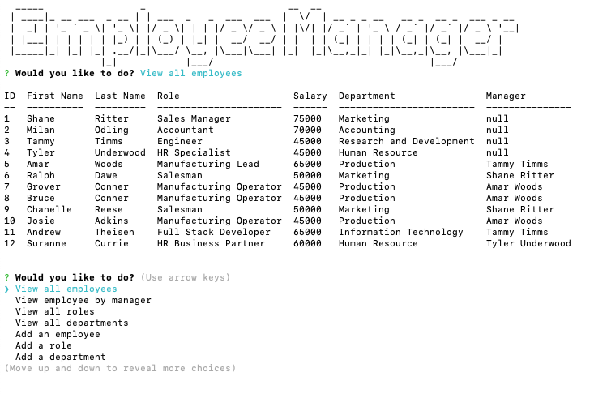
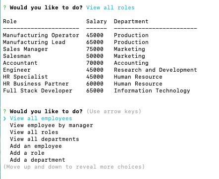
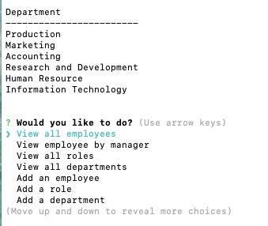
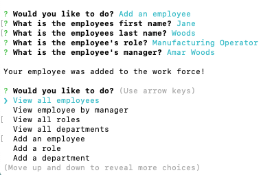
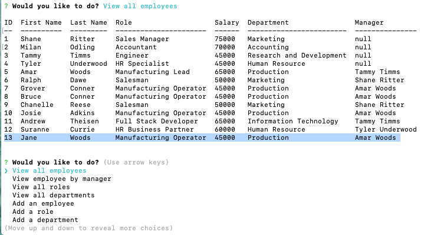
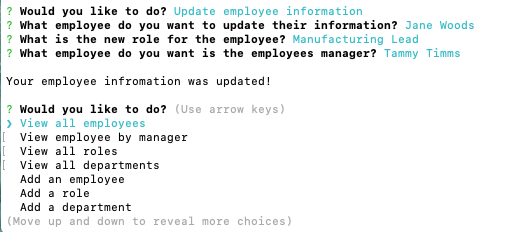
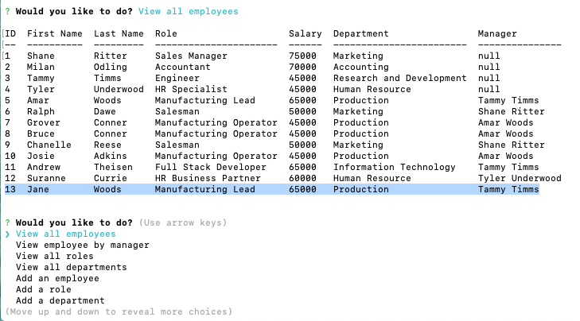

# 12-Employee-Tracker

## Live site:

Read Me:
https://theisen92.github.io/12-Employee-Tracker/

## Usage

Usage would be for someone wanting to manage, add and update employees in a company

## Credits

I primarily used the information from class activities and MDN Developer for resources. Used figlet npm for the art and cTable to display the information

## Contributing

I worked on with one of my classmates

## Challenges

The main challenge that I was running into during this project was linking the information to the id, linking tables in mysql and how to display the information in terminal.

## Functionality

Show all employees

Show all roles

Show all departments

Adding an employee

Updating an employee

